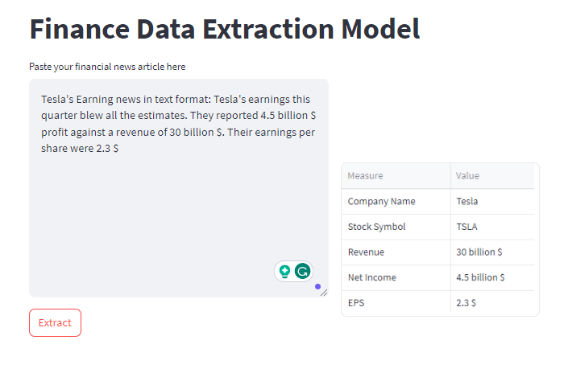

# Finance Data Extraction Model

This project uses OpenAI's GPT-3.5 Turbo model to extract financial data from news articles and retrieve relevant information such as company name, stock symbol, revenue, net income, and earnings per share (EPS).




## Usage

1. Install the required libraries by running the following command:

```bash
pip install openai pandas streamlit
```

2.Create a `secret_key.py` file in the project directory and define your OpenAI API key as `openai_key`. Ensure that you keep this file private and do not share it on GitHub.

3.Run the `main.py` script to use the model. The script will open a Streamlit app where you can paste your financial news article and click the "Extract" button to retrieve the financial data.

## Example

```bash
import streamlit as st
import pandas as pd
import model

st.title("Finance Data Extraction Model")
col1, col2 = st.columns([3,2])

financial_data_df = pd.DataFrame({
     "Measure": ["Company Name", "Stock Symbol", "Revenue", "Net Income", "EPS"],
     "Value": ["", "", "", "", ""]
 })

# ... (rest of the code)
```

### Important Note

- Make sure to keep your secret_key.py file containing the OpenAI API key private and never share it on GitHub or any public repository.

- This model relies on the accuracy of the underlying GPT-3.5 Turbo model from OpenAI. Sometimes, the model might not be able to extract accurate financial data, and the returned values may not be correct.

### License

This project is licensed under the MIT License.

